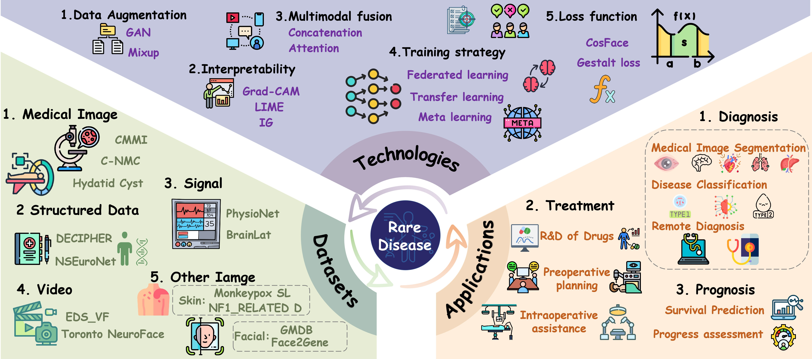

<div align="center">
  
</div>


<div align="center">    
  
# Computer Vision for Rare Diseases: A Scoping Review   
  
</div>

[](https://opensource.org/licenses/MIT)

 


---
## 🌐 Overview

This is the official data and code repository for the paper:

**"Computer Vision for Rare Diseases: A Scoping Review"**  
*Zhichuan Xu, Jie Song, Cheng Bi, Yuxin Zhang, Xin Zheng, Meng Xiao, Jiale Du, Rongrong Wu, Bairong Shen*


Rare diseases, despite their individual rarity, collectively impact over 300 million people worldwide and pose significant challenges due to clinical heterogeneity, delayed diagnosis, and limited expertise. Computer Vision (CV) technologies—through the analysis of medical images, pathological slides, facial features, and other physical manifestations—show great promise in addressing these challenges, enabling automated screening, assisted diagnosis, patient subtyping, monitoring, surgical support, and prognostic evaluation.
However, CV research in rare diseases remains fragmented, with limited systematic overviews of available datasets, cutting-edge technologies, and real-world clinical applications.
In this scoping review, we analyze 772 publications in the field, summarize publicly available datasets, and highlight recent advances in CV methods, including data augmentation, interpretability, multimodal fusion, training strategies, and loss function design. We categorize clinical applications across major rare disease types—such as ophthalmic, neurologic, developmental, skeletal, respiratory, genitourinary, cardiovascular, hematologic, rheumatologic, and endocrine/metabolic diseases—and discuss key barriers to clinical adoption, including data privacy, fairness, data scarcity and imbalance, annotation quality, interpretability, and computational constraints. We also propose future directions, such as multidisciplinary collaboration, privacy-preserving data sharing, domain adaptation, advanced interpretability, and efficient model deployment.
Our aim is to provide a comprehensive reference for researchers and clinicians by systematically mapping the CV landscape in rare diseases, fostering the advancement and clinical translation of CV-driven technologies in this important field.

<div align="center">
  
  <br>
  <em>Figure: Graphical abstract of our scoping review.</em>
</div>


## 📁 Repository Structure

```bash
.
├── README.md                # Project documentation
├── Table-CV Models.xlsx     # Summary of CV models for rare diseases (772 studies)
├── Table-Dataset.xlsx       # Summary table of 28 publicly available datasets
├── figures/
│   ├── Graphical_abstract.jpg
│   └── logo.png
└── scripts/
    ├── disease_names.csv
    ├── RD_Linearisation_Classification.csv
    ├── pubmed_results.xlsx
    ├── en_product1.json
    ├── group_1_query.txt
    ├── group_2_query.txt
    ├── group_3_query.txt
    ├── group_4_query.txt
    ├── group_5_query.txt
    ├── group_6_query.txt
    ├── group_7_query.txt
    ├── group_8_query.txt
    ├── group_9_query.txt
    ├── group_10_query.txt
    ├── group_11_query.txt
```

## 📁 Resources
- `Table-CV Models.xlsx`: Comprehensive summary of 772 computer vision studies for rare diseases, including disease type, data modality, algorithm, clinical application, and performance.
- `Table-Dataset.xlsx`: Curated list of 28 publicly available datasets for CV research in rare diseases, with details on data type, disease coverage, access link, and source.
- `scripts/`:
    - `disease_names.csv`: All rare disease names and synonyms used for literature search.
    - `RD_Linearisation_Classification.csv`: Disease classification mapping according to Orphanet.
    - `pubmed_results.xlsx`: Full list of retrieved and screened publications.
    - `group_x_query.txt` & `en_product1.json`: All PubMed search scripts and query generation resources.

## 🔍 Literature Search Reproducibility
We provide all scripts for replicating our PubMed and Google Scholar literature retrieval:

1. **Disease Term Expansion**:  
   Use `disease_names.csv` and `en_product1.json` to generate comprehensive search queries.
2. **Structured Search**:  
   `group_x_query.txt` files contain all grouped PubMed queries used in our study.
3. **Classification Mapping**:  
   `RD_Linearisation_Classification.csv` enables mapping of publications to disease categories.
4. **Result List**:  
   `pubmed_results.xlsx` contains the full screening and inclusion list (n=772).

## ❓ How to Use
- **Reproduce our literature search:**  
  Use the scripts in `scripts/` to generate search queries and map retrieved publications.
- **Benchmark or meta-analysis:**  
  Refer to `Table-CV Models.xlsx` and `Table-Dataset.xlsx` for foundational resources in computer vision for rare diseases.
- **Dataset access:**  
  Public dataset links are provided in `Table-Dataset.xlsx` for direct download and further research.
- **Citation:**  
  Please cite our paper and repository if you use these resources in your work.

## 🤝 Contact
For technical questions, suggestions, or collaborations, please open an issue or contact:
- Zhichuan Xu: zhichuanxu2001@wchscu.cn
- Jie Song: songjie02_09@163.com

## 📜 License
MIT License  

## 📚 Citation
The paper is currently under review. 
```